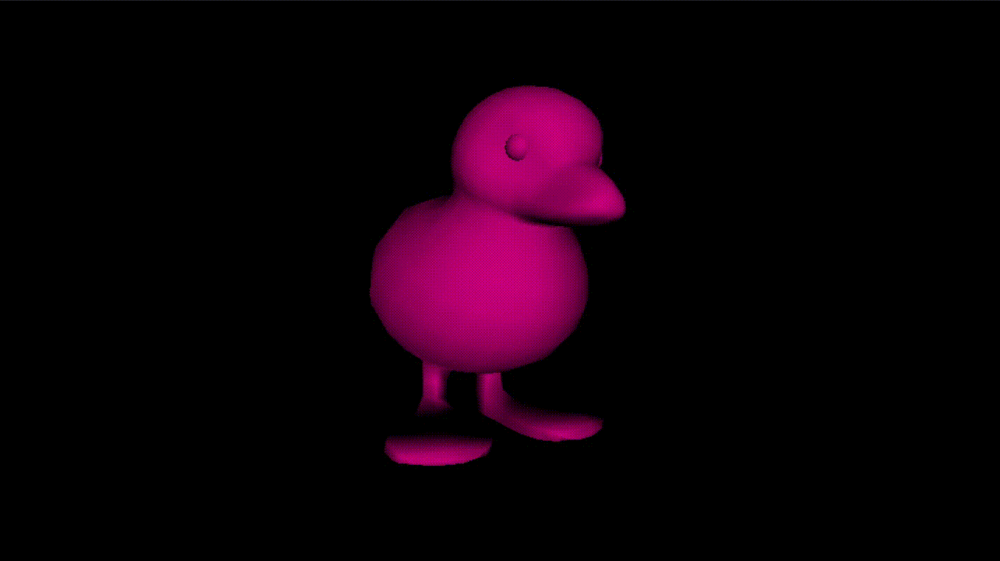
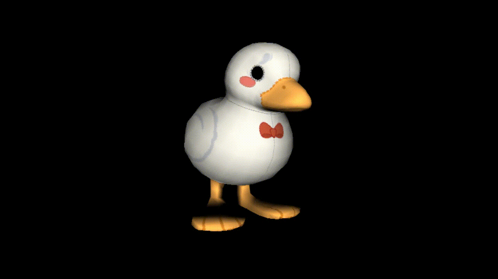
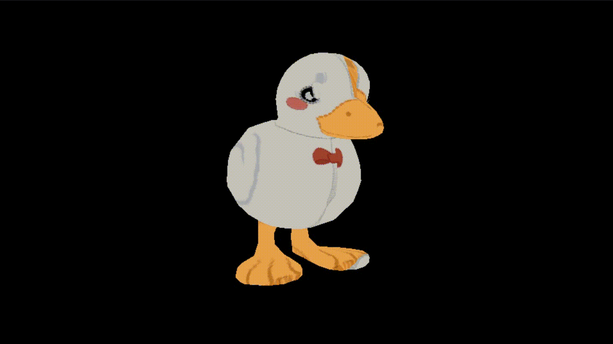
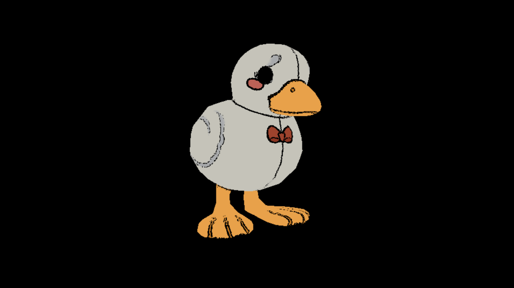

# Lab-4
Branch para el laboratorio 4 del curso.

## Shaders

  ### Party shader
  Consiste en el cambio intermitente entre tres colores (rosa, morado y celeste).

  
  
  Para implementarlo utilizar los siguientes vertexShader y fragmentShader:
  ```bash
    renderer.setShader(vertex_shader, party_fragment_shader)
  ```

  U oprimiendo la tecla **5** mientras el programa esté en ejecución.

  ### Sparkling shader
  Consiste en el cambio intermitente de la iluminación de la escena, se puede modificar la velocidad del cambio.

  
  
  Para implementarlo utilizar los siguientes vertexShader y fragmentShader:
  ```bash
    renderer.setShader(vertex_shader, sparkling_fragment_shader)
  ```

  U oprimiendo la tecla **6** mientras el programa esté en ejecución.

  ### Distorsioned shader
  Consiste en el movimiento ondular de la textura dentro del modelo, intenta simular el comportamiento del movimiento del agua.

  
  
  Para implementarlo utilizar los siguientes vertexShader y fragmentShader:
  ```bash
    renderer.setShader(vertex_shader, distorsioned_fragment_shader)
  ```

  U oprimiendo la tecla **7** mientras el programa esté en ejecución.

  ### Outline shader
  Consiste en delineado del modelo en color negro.

  
  
  Para implementarlo utilizar los siguientes vertexShader y fragmentShader:
  ```bash
    renderer.setShader(vertex_shader, outline_fragment_shader)
  ```

  U oprimiendo la tecla **8** mientras el programa esté en ejecución.
